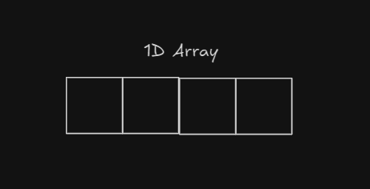
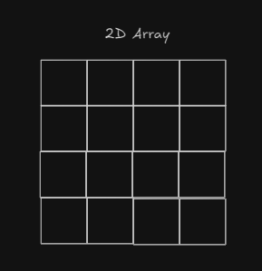
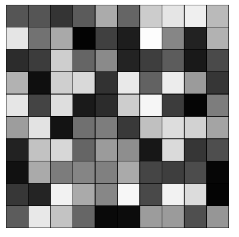

# Making a 2D array in javascript
Arrays can be visualised as following:


So yea if we want to make something related to coordinates, it's a very useful thing to use.

## Example:

```js
   let cols = 10
        let rows = 10
        function setup(){
            createCanvas(300, 300)
        }

        function draw(){
            background(51)

            for(let i=0;i<cols;i++){
                for(let j=0;j<rows;j++){
                var x = i*30
                var y = j*30
                stroke(0)
                fill(255)
                rect(x,y,30,30)
                }   
            }
        }
```
This creates a grid. Now, I want to make a 2D array to assign them colors.

To create a 2D array, we can do the following:

```js
 var colors = []
        function setup() {
            createCanvas(300, 300)
            for (let i = 0; i < cols; i++) {
                colors[i] = []
                for (let j = 0; j < rows; j++) {
                    colors[i][j] = Math.random()
                }
            }
        }
```
And now if I apply these colors to the grid, I get this:

