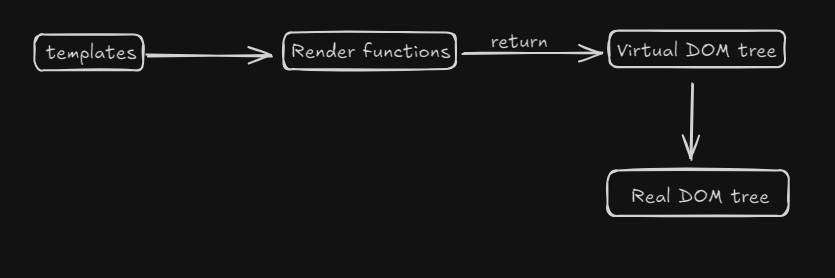
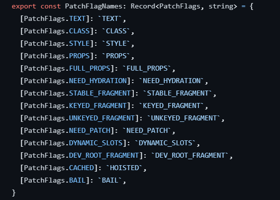
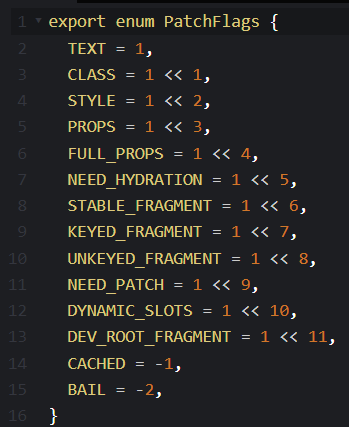

# VueJS

## Lifecycle Methods:
- onBeforeMount: Before mounting begins
- onMounted: after mounting
- onBeforeUpdate: called when reactive data changes and before re-render.
- onUpdated: called after re-render
- onBeforeUnmount: called before the vue instance is destroyed
- onUnmounted: called after the instance is destroyed
- onActivated: called when a kept-alive component is activated
- onDeactivated: called when a kept-alive component is deactivated
- onErrorCaptured: called when an error is captured from a child component

## Internal working of Vue
Vue internally uses a virtual dom in its rendering process. The virtual dom is a tree that has got virtual nodes, where each virtual node describes a certain UI element.For example, consider the following HTML code.

```html
<div id="section">
<button id="button"> </button>
</div>
```
The above UI might be written in virtual dom as follows:
```js
const vnode = {
type:'div',
props:{
    id:"section"
},
children:[
    {
        type:'button',
        props:{
            id:button
        },
        children:[]
    }
]
}
```

So at the time of rendering, the renderer walks through the virtual dom tree and constructs the real DOM tree from it.
This process is called **Mount**

Further, the renderer can also compare 2 virtual dom trees, hence finding the difference and reflecting those changes on actual virtual dom, this is called **patching** or **diffing**

## Working


### Downside of virtual dom:
When we make changes, the mounting algorithm remakes the entire virtual dom tree for the entire UI, so even if a certain component is never changed, it's vnodes are recreated, resulting in unnecessary memory pressure. In a way, the mounting process is brute-force
Though, that isn't the case with Vue (entirely)
Here, the compiler can statically analyze the template and leave hints in the generated code so that the runtime can take shortcuts. This is called **Compiler-informed Virtual DOM**

### Ways in which Vue optimizes runtime performance of vdom:
1) Static UI parts are hoisted outside the render functions, so new vnodes are not made for them :)
2) When there are consequtive elements which are static, it makes only one vnode and puts those elements into the vnode as a **string**. Also, their DOM nodes are cached on initial mount.
3) Vue uses patch flags to help the runtime skip certain steps.
Following are all the patch flags.



Example:
If I have :
```html
<div>
<span>hi</span>
</div>
```
OUTPUT:
```js
 _createElementVNode("span", null, "hello", -1 /* HOISTED */)
```
In the patch flags class, we can see -1 code is for Cached, i.e. new dom node is not made for this again and again.
But, if I change the template a bit, the code changes.
```html
<div>
<span>{{hi}}</span>
</div>
```
OUTPUT:
```js
_createElementVNode("span", null, _toDisplayString(hello), 1 /* TEXT */)
```
The TEXT flag means that it will only change the the text on detecting change rather than re-rendering entire component!