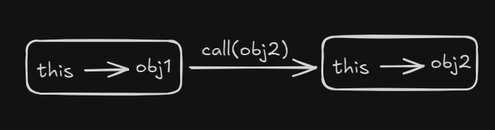
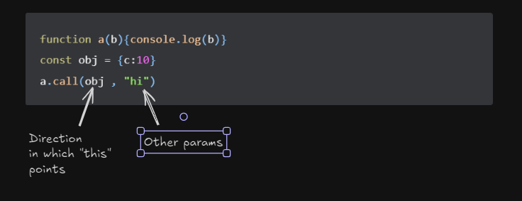
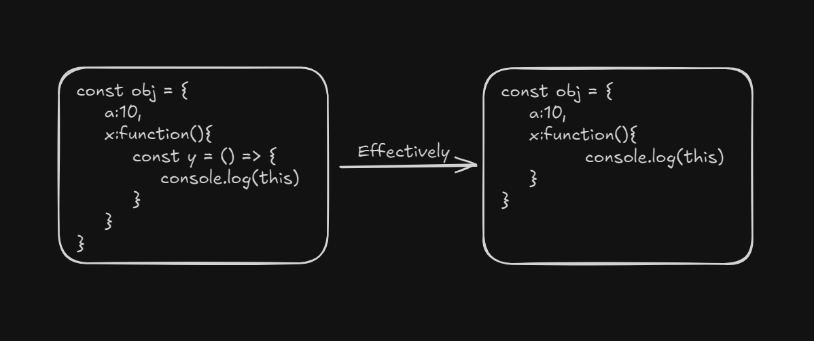

# this Keyword
 ## Using this in global space
 ```js
console.log(this)
 ```
 this code will print out the global object, for browsr, this global object is **Window{...}**

 ## Using this in function
```js
function test(){
    console.log(this)
}
```
It again returns the **Window{...}** object :skull:

## Another twist
Using "use strict" at the top of your js file, changes the output to "undefined" :skull:

```js
"use strict"
function test(){
    console.log(this)
}
x()
```
The difference occurs because of something called **"this substitution"**. It happens in _non strict_ mode only. So, the value of "this" inside a function is originally **undefined**, but if we use non strict mode, the value will be replaced by globalObject.

### this keyword's value depends on how the function is called
```js
function x(){
    console.log(this)
}

x() // OUTPUT: undefined
window.x() //OUTPUT: Window{...}
```
So, from pure observation, we can deduce that: **When function is called without any reference to an object, it is undefined**

### this inside an object's method
_Note: A method is a function used inside an object_
```js
const obj = {
    a:20,
    x: () => {
       console.log(this) 
    }
}

obj.x() //OUTPUT: {a:20 , x:f}
```

### Call, Apply and Bind methods (sharing methods)
```js
const obj1 = {
    id:1,
    getID:function (){
        console.log(this.id)
    }
}
const obj2 = {id:2}
```
Now, I want to use the getData() function for obj2, but it exists on obj1. This can be done as follows:
```js
obj1.getID().call(obj2)
```
When I use the _.call()_ function and pass in obj2, I am actually changing , or overriding the defination of the keyword **this** from obj1 to obj2.

**.call() , .apply(), .bind() all are used to override value of this**

- .call() is used for function borrowing.

In simple terms, .call() is used to tell the direction in which the "this" keyword should point. 
```js
function a(b){console.log(b)}
const obj = {c:10}
a.call(obj , "hi")
```


- .apply() : It's literally .call(), except we pass the params as an array.
```js
function a(b,d){console.log(`${b}${d}`)}
const obj = {c:10}
a.call(obj , ["hi" , "bye"])

```

- .bind() : Unlike the other two, this returns a copy of the function, while other two invoke the function.
```js
function a(b){console.log(b)}
const obj = {c:10}
a.bind(obj , "hi")
```

## Arrow functions
They don't have their own **this** binding. So, on using "this" inside arrow, it uses **value of enclosing lexical context** :skull:

In simple words, the "this" keyword will work as if it is placed in the place it is lexically placed.



## this Keyword in DOM
Here, "this" is simply reference to HTML elements.
Example:
```html

<button onclick="alert(this.tagName)">hello</button>
<!-- OUTPUT: BUTTON-->
```
